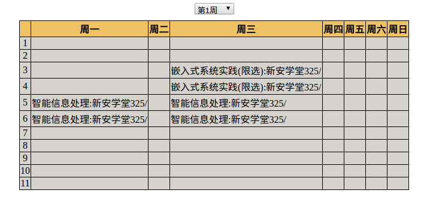
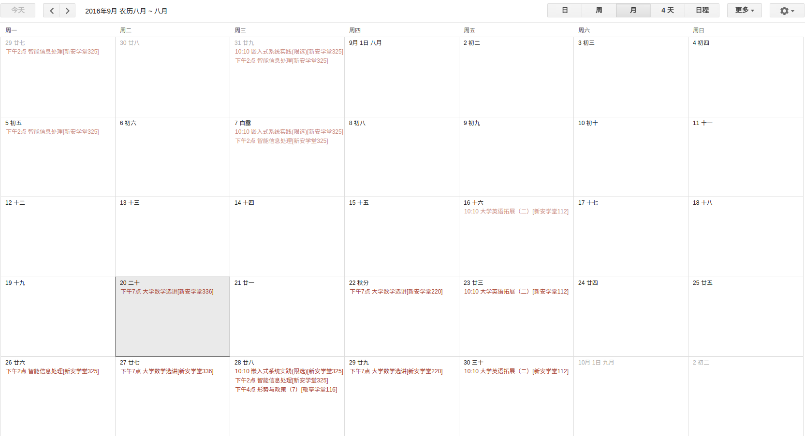

.. _advanced:

高级技巧
==============

这一部分提供了使用 hfut 的一些高级技巧.

.. note:: 例子仅作为学习的参考或者为你的使用提供思路, 我只能确保在自己的环境下能够正常工作. 如果你想提供修改意见或者添加例子可以
 `在 GitHub 上提交 Issue <https://github.com/er1iang/hfut/issues>`_ 或者直接提交 Pull Request.

使用 hfut 下载全校学生证件照
-----------------------------------------------

..  literalinclude:: ../examples/hfut_img.py

在全平台使用 hfut 编写课表工具
-----------------------------------------------

..  literalinclude:: ../examples/web_curriculum.py

将课表导出为日历文件
-----------------------------------------------

..  literalinclude:: ../examples/curriculum_calendar.py
